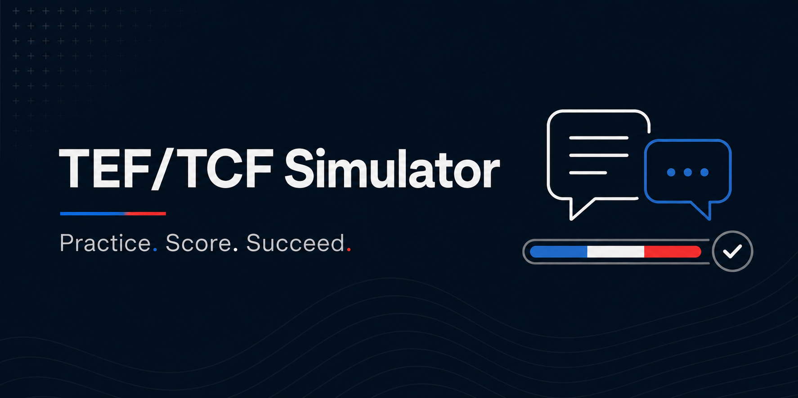

<div align="center">



</div>

```
████████╗███████╗███████╗    ██╗  ██╗    ████████╗ ██████╗███████╗
╚══██╔══╝██╔════╝██╔════╝    ╚██╗██╔╝    ╚══██╔══╝██╔════╝██╔════╝
   ██║   █████╗  █████╗       ╚███╔╝        ██║   ██║     █████╗
   ██║   ██╔══╝  ██╔══╝       ██╔██╗        ██║   ██║     ██╔══╝
   ██║   ███████╗██║         ██╔╝ ██╗       ██║   ╚██████╗██║
   ╚═╝   ╚══════╝╚═╝         ╚═╝  ╚═╝       ╚═╝    ╚═════╝╚═╝
```

<div align="center">

**Unofficial simulator for the TEF Canada and TCF Canada French proficiency exams**

[](https://nextjs.org/)
[](https://www.typescriptlang.org/)
[](https://www.prisma.io/)
[](./LICENSE)
[](#choosing-an-ai-provider)

Timed, no-backtrack practice for listening comprehension and the writing
section · auto-scored MCQ + AI-assisted NCLC/CLB scoring · original content
only, never real exam questions

[Quick Start](#quick-start) · [How It Works](#how-it-works) · [Generating Listening Audio](#generating-listening-comprehension-audio) · [Choosing an AI Provider](#choosing-an-ai-provider) · [Contributing](#contributing)

</div>

> This is an **independent, unofficial** project, with no affiliation to CCIP
> (Chambre de Commerce et d'Industrie de Paris Île-de-France), France
> Éducation International, IRCC, or the Canadian government. All practice
> content is original and does not reproduce real exam questions.

Free, realistic practice tools for TEF/TCF are scarce, especially in a
digital format faithful to the real exam. This project aims to fill that gap
in an open, collaborative way — replicating the format, timing, and
structure of the real exams as closely as possible, and estimating a level
(NCLC/CLB) via AI-assisted scoring.

**Status:** under development — Phase 1 (writing expression) shipped, Phase 2
(listening comprehension) shipped, reading comprehension still pending.

## Quick Start

Requires Node.js 20+ and Python 3.10+ (only needed if you want listening
audio — see below).

```bash
git clone <this-repo-url>
cd tef-tcf-simulator-starter
npm install
cp .env.example .env.local
```

Open `.env.local` and set `AI_PROVIDER` plus that provider's key — pick
whichever's easiest for you:

- Already have a Claude, Gemini, or ChatGPT API key? Set `AI_PROVIDER` to
  `anthropic`, `gemini`, or `openai` and paste the key.
- Prefer not to send anything to a third party, or want it to work offline?
  Set `AI_PROVIDER="ollama"` and install [Ollama](https://ollama.com) — no
  key needed. See the [provider table](#choosing-an-ai-provider) below for
  exact env vars.

Then:

```bash
npx prisma db push   # creates the local SQLite dev.db
npm run dev
```

Open **http://localhost:3000**, pick an exam and target level, and complete
the simulation — listening comprehension first, then the writing section,
back-to-back, same order as the real exam. First time through, you'll be
offered a short walkthrough explaining how the simulation works — it's
optional and only ever shown once per browser.

Listening audio isn't committed to the repo (see
[below](#generating-listening-comprehension-audio)); without it, listening
tasks will just show a broken audio player. Generate it locally first if you
want to actually hear the dialogues.

To stop the app, `Ctrl+C` in the terminal running `npm run dev` — that's it,
nothing else to clean up (SQLite is a local file, no background services).

## How it works

- Choose your exam (TEF or TCF) and target level, then take the full
  simulation under exam-like conditions: timed per task, no dictionary, no
  going back once you move forward.
- **Listening comprehension** comes first: 6 short French dialogues (each
  with distinct synthesized voices per speaker), one multiple-choice
  question each, scored automatically.
- **Writing expression** comes next: an AI model scores your text based on
  the real evaluation criteria (linguistic, pragmatic, sociolinguistic) and
  estimates your NCLC/CLB level.
- Results show a score per section plus a combined overall estimate.
- **The score is an educational estimate, not an official evaluation.**

## Generating listening-comprehension audio

Listening dialogues are scripted in `content/{tef,tcf}/comprehension_orale/questions.json`
(who says what, in which voice) but the `.wav` files themselves are **not**
committed — they're generated locally with
[pocket-tts](https://github.com/kyutai-labs/pocket-tts), a small CPU-only
text-to-speech model, so the repo stays light and every learner gets freshly
synthesized (but deterministic-content) audio.

```bash
python3 -m venv .venv && source .venv/bin/activate   # optional but recommended
pip install pocket-tts scipy
npm run generate:audio            # generates for both TEF and TCF
npm run generate:audio -- --exam tef   # or just one exam
npm run generate:audio -- --force      # regenerate even if files exist
```

Files land in `public/audio/{tef,tcf}/comprehension_orale/` (gitignored).
The app runs fine without this step — you just won't hear anything until
you generate the audio.

## Stack

Next.js (App Router) · TypeScript · Tailwind · Prisma (SQLite in dev,
Postgres in production) · pluggable AI scoring · pocket-tts (local, on-demand
listening audio)

## Choosing an AI provider

Scoring goes through a pluggable provider (`src/lib/ai`), picked via the
`AI_PROVIDER` env var. Only the selected provider's key is required.

| `AI_PROVIDER` | Needs | Notes |
| --- | --- | --- |
| `anthropic` (default) | `ANTHROPIC_API_KEY` | Get a key at [console.anthropic.com](https://console.anthropic.com/). `ANTHROPIC_SCORING_MODEL` optional, defaults to `claude-opus-4-8` |
| `gemini` | `GEMINI_API_KEY` | Free tier via [Google AI Studio](https://aistudio.google.com/apikey). `GEMINI_SCORING_MODEL` optional, defaults to `gemini-flash-latest` (an auto-updating alias, since Google retires dated model names quickly) |
| `openai` | `OPENAI_API_KEY` | Get a key at [platform.openai.com](https://platform.openai.com/api-keys). `OPENAI_SCORING_MODEL` optional, defaults to `gpt-5` |
| `ollama` | A running [Ollama](https://ollama.com) instance | No API key, runs fully locally/offline. `OLLAMA_BASE_URL` optional, defaults to `http://localhost:11434`. `OLLAMA_SCORING_MODEL` optional, defaults to `llama3.1` — pull it first with `ollama pull llama3.1`. Use a model that supports structured JSON output for reliable scoring |

Adding another provider means implementing the small `ScoringProvider`
interface in `src/lib/ai/` and registering it in `src/lib/ai/index.ts`.

## Contributing

The easiest way to contribute is by adding new practice prompts under
`/content` — see `docs/data-schema.md` for the expected `PromptItem` format.
All content must be original (CC-BY-SA license).

## License

- Code: [MIT](./LICENSE)
- Content (`/content`): CC-BY-SA — see `CONTENT_LICENSE.md`
